# Hanbok-Store project - 우태식, 박용진, 박세희, 정호영

# 1. 프로젝트 소개 및 선정 이유

이 프로젝트는 현대적인 감각의 생활 한복을 누구나 쉽게 접하고 구매할 수 있도록 제작한 웹사이트입니다.

기존 한복이 가지고 있는 전통적인 이미지를 넘어, 일상에서도 편하게 착용할 수 있는 생활 한복을 소개하고 다양한 상품 정보를 제공하는 것을 목표로 하였습니다.

또한 HTML, CSS, JAVASCRIPT를 활용한 웹 개발 능력을 향상시키고 Git과 GitHub를 이용한 협업 경험을 쌓기 위해 진행한 프로젝트입니다.

### 📌 주요 기능

- 생활 한복 상품 소개
- 상품 상세 페이지 제공
- 카테고리별 상품 분류
- 고객 문의(FAQ) 페이지
- 회원가입 및 마이페이지

---

# 2. 사용 기술
- HTML5
- CSS3
- JavaScript
- Git
- GitHub
- Visual Studio Code

---

# 3. 팀원 역할

| 이름 | 담당 영역 |
|------|-----------|
| 우태식 | Notice, Q&A, Review Page |
| 박용진 | Cart, Order, Order-result Page |
| 박세희 | Login, Join, Mypage Page |
| 정호영 | Index, products, product-detail Page |

# 4. 이미지

---

## 4-1. Main Page

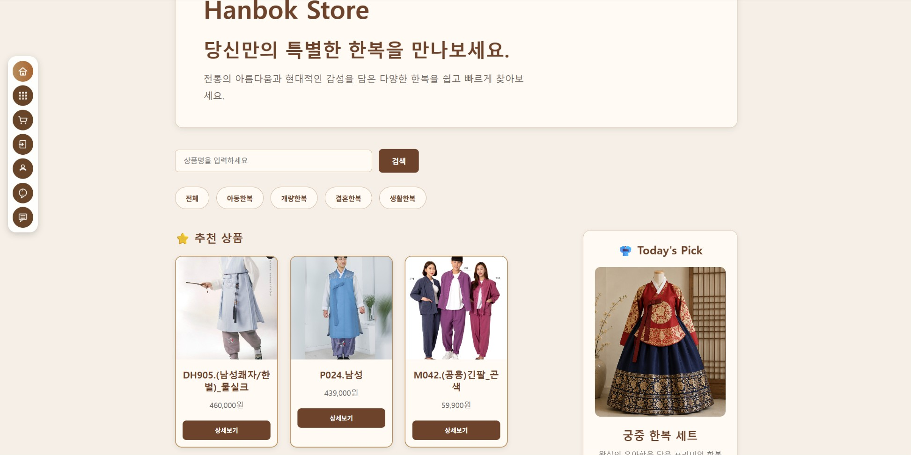

### 설명

메인 페이지에서는 다양한 생활 한복 상품을 한눈에 확인할 수 있도록 구성하였습니다.

- 추천 상품 제공
- 상품 검색 기능
- 카테고리별 상품 분류
- Today's Pick 추천 상품 제공

---

## 4-2. Products Page

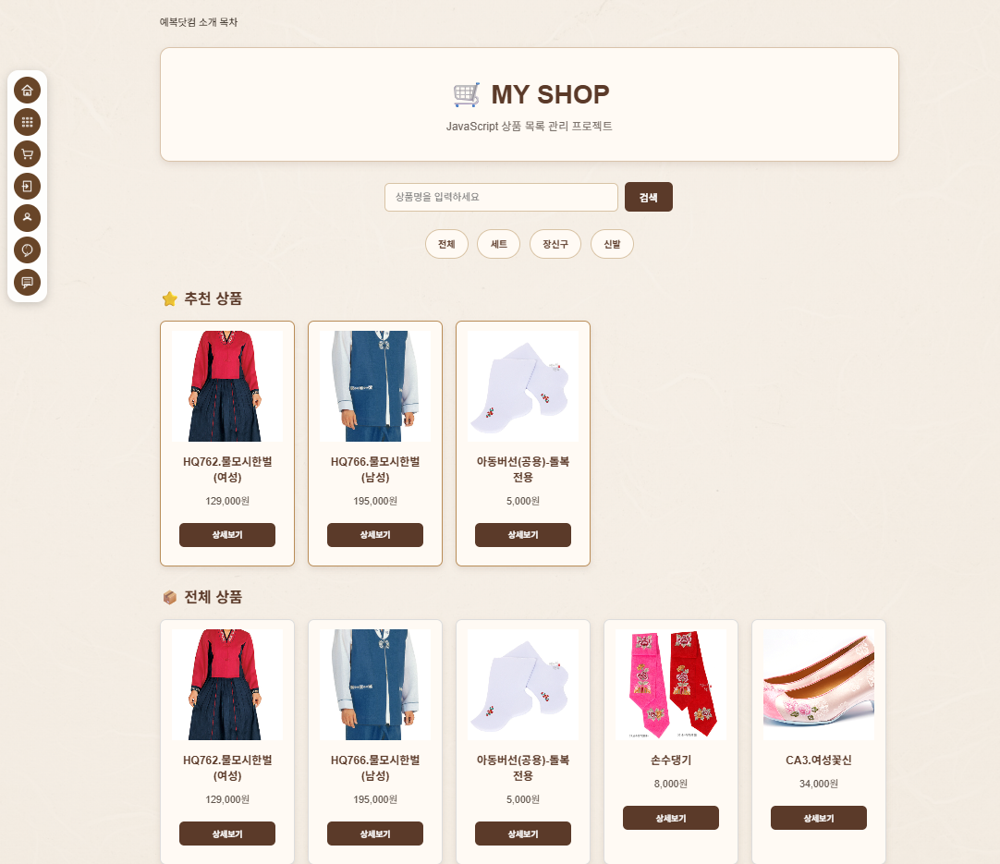

### 설명

상품 목록 페이지에서는 다양한 한복 상품을 확인하고 원하는 상품을 검색할 수 있습니다.

- 상품 검색 기능
- 카테고리별 필터
- 추천 상품 제공
- 상품 상세 페이지 이동

---

## 4-3. Product Detail Page

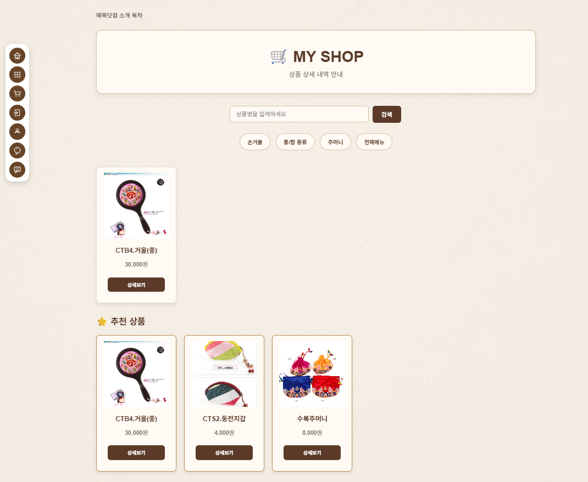

### 설명

선택한 상품의 상세 정보를 확인할 수 있는 페이지입니다. 상품의 카테고리, 가격 및 정보를 알 수 있습니다.

- 상품 이미지 제공
- 상품 설명
- 가격 및 옵션 확인
- 장바구니 담기

---

## 4-4. Cart Page

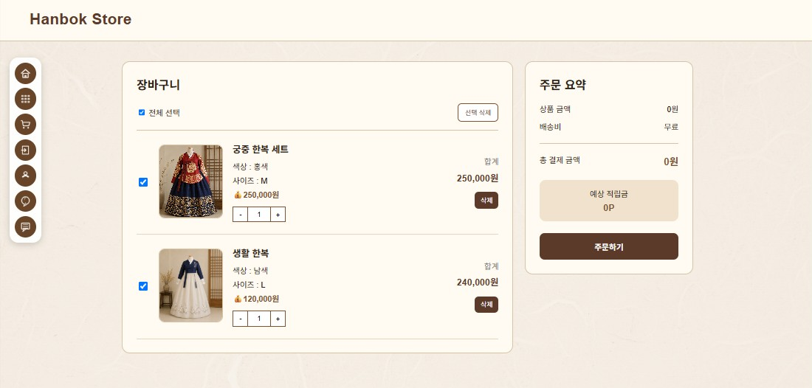

### 설명

장바구니에 담은 상품을 확인하는 페이지 입니다. 상품을 추가 및 삭제가 가능하며 주문하기 버튼을 누르면 주문이 완료됩니다.

- 수량 변경
- 상품 삭제
- 총 결제 금액 계산
- 주문하기

---

## 4-5. Order Page

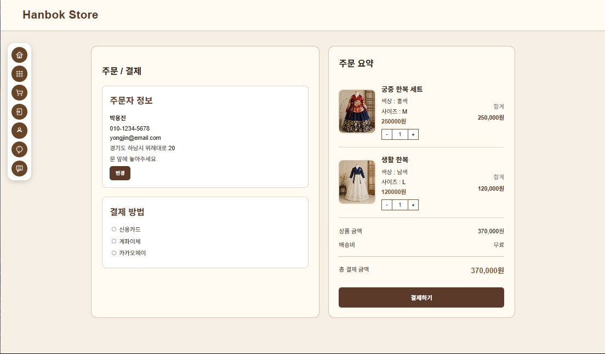

### 설명

장바구니에 담은 상품의 결제를 진행하는 페이지입니다. 주문자 정보 수정이 가능하며 결제 방법을 선택할 수 있고 상품 주문 요약서를 볼 수 있습니다.

- 주문자 및 배송 정보 입력
- 결제 방법 선택
- 결제하기
- 주문 완료

---

## 4-6. Order Result Page

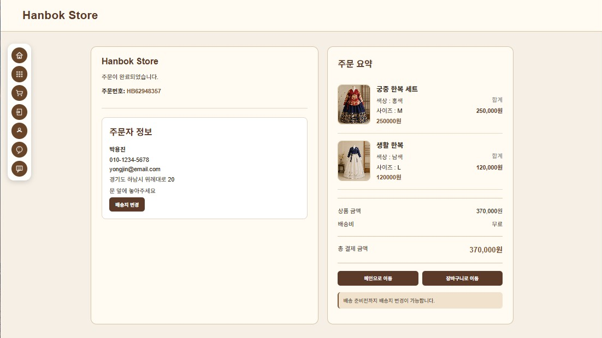

### 설명

주문 완료 후 결과를 확인하는 페이지입니다. 사용자의 주문 정보를 확인할 수 있으며 메인으로 이동 버튼을 누르면 메인으로 이동하게 되고 배송 준비전까지 배송지 변경이 가능합니다.

- 주문번호 확인
- 주문자 정보 확인
- 주문 요약 안내
- 메인 페이지 이동

---

## 4-7. Login Page

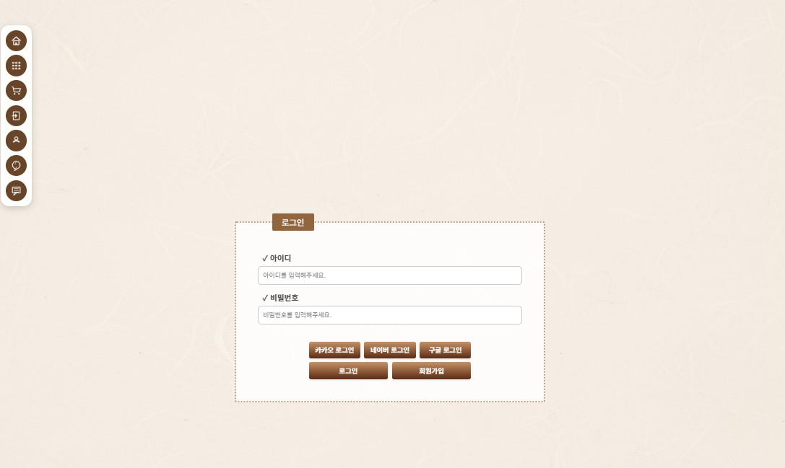

### 설명

회원 로그인을 위한 페이지입니다. 회원가입을 한 아이디 및 비밀번호로만 로그인이 가능합니다. 회원가입을 누를 시 회원가입 페이지로 이동합니다.

- 아이디 입력
- 비밀번호 입력
- 로그인
- 회원가입 이동

---

## 4-8. Join Page

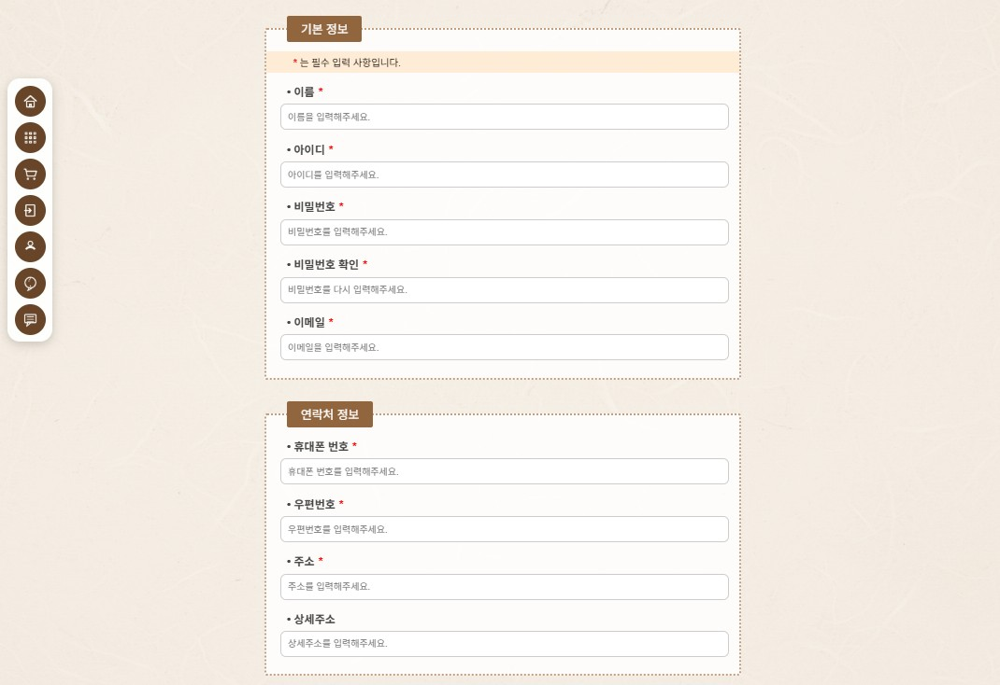

### 설명

회원가입을 진행하는 페이지입니다. 기본 정보와 연락처 정보를 필수로 입력해야하며 하나라도 적지 않을시 입력안내 문구가 나옵니다.

- 회원 정보 입력
- 입력값 유효성 검사
- 약관 내용 확인
- 회원가입 완료

---

## 4-9. My Page

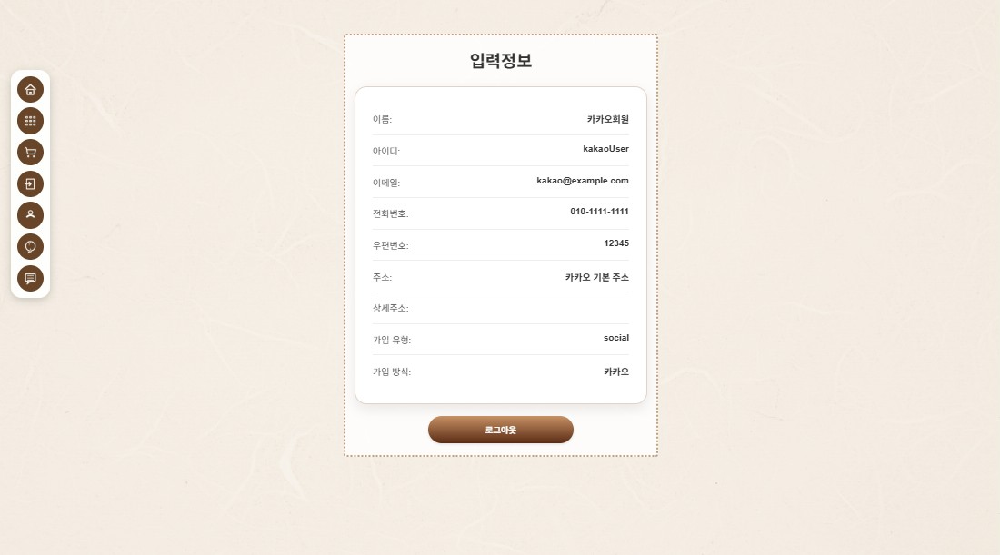

### 설명

회원 정보 확인 및 수정할 수 있는 페이지입니다. 로그아웃 버튼을 누르게 되면 로그아웃되고 정보가 사라집니다.

- 회원 정보 조회
- 로그아웃 기능
- 주문 내역 확인
- 개인정보 수정

---

## 4-10. Review Page

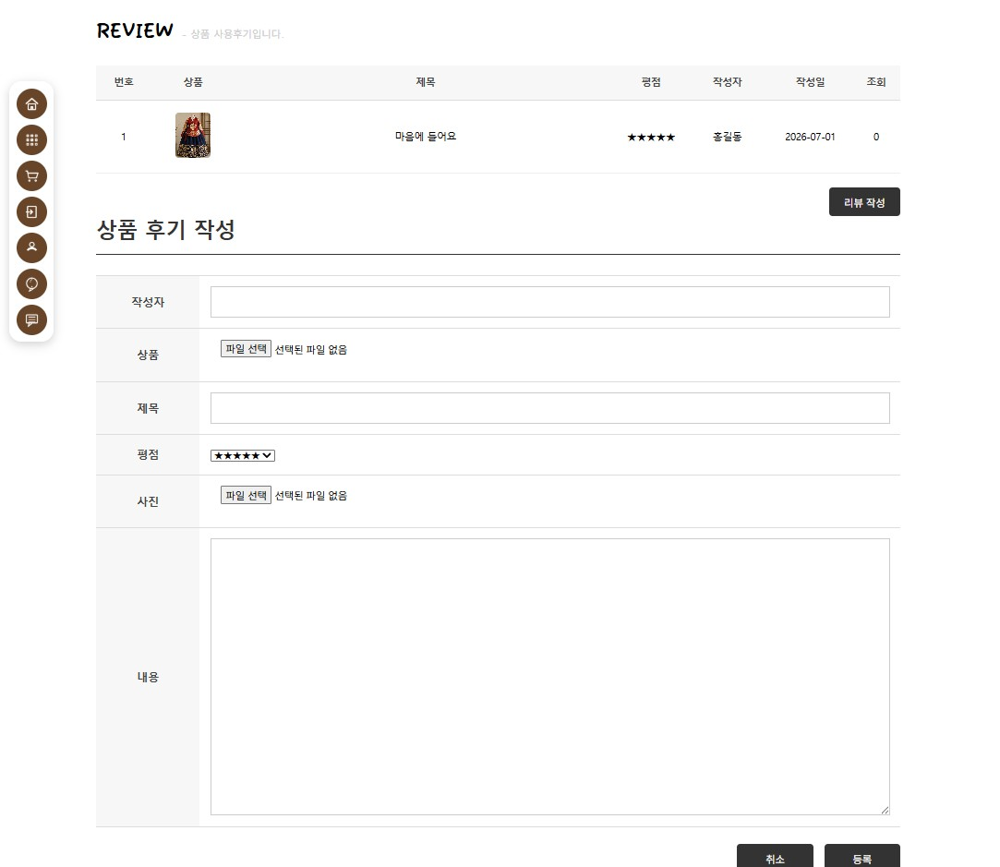

### 설명

상품의 사용후기를 확인하고 리뷰를 작성할 수 있는 페이지입니다. 리뷰 작성 버튼을 누르면 아래 폼에 리뷰 작성할 수 있는 공간이 생깁니다.

- 리뷰 목록
- 리뷰 작성
- 평점 확인

---

## 4-11. Notice Page

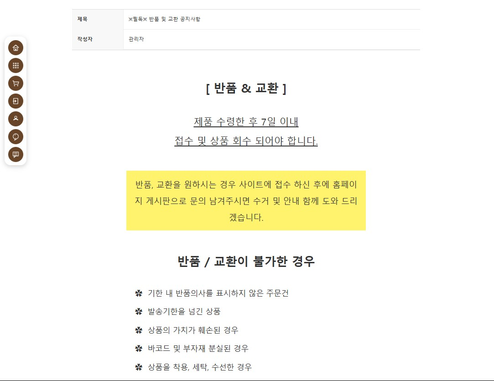

### 설명

한복 스토어의 공지사항을 확인할 수 있는 페이지입니다.

- 공지사항 확인
- 공지 상세보기

---

## 4-12. Q&A Page

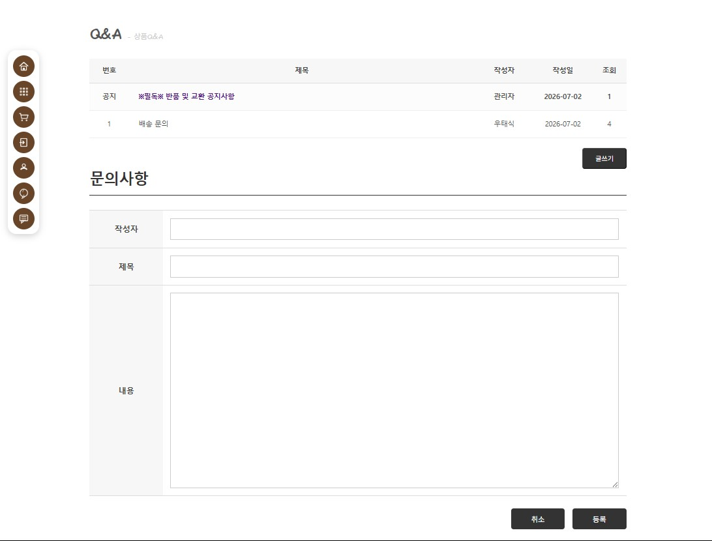

### 설명

상품 및 서비스에 대한 문의를 확인할 수 있는 페이지입니다. 글쓰기 버튼을 누르면 문의사항을 작성할 수 있는 폼이 생깁니다.

- 질문 등록
- 문의 목록
- 답변 확인
- 공지사항 목록

